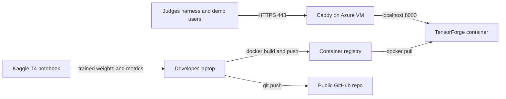
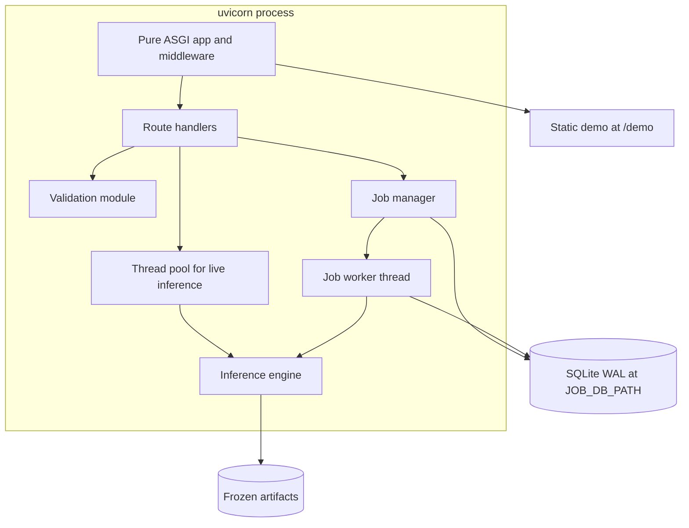
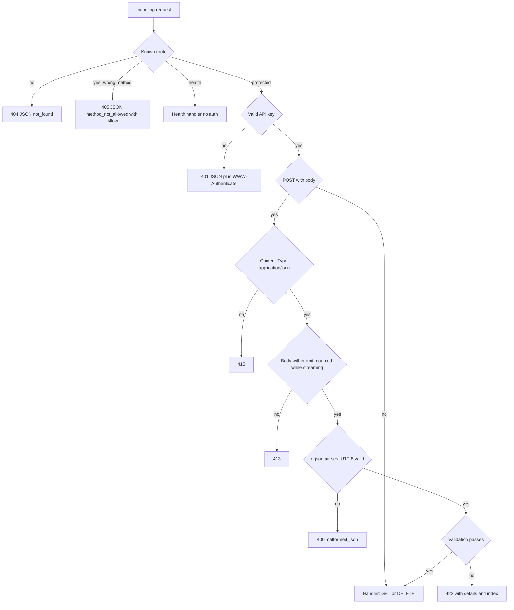
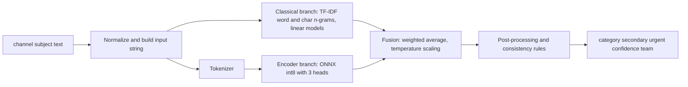
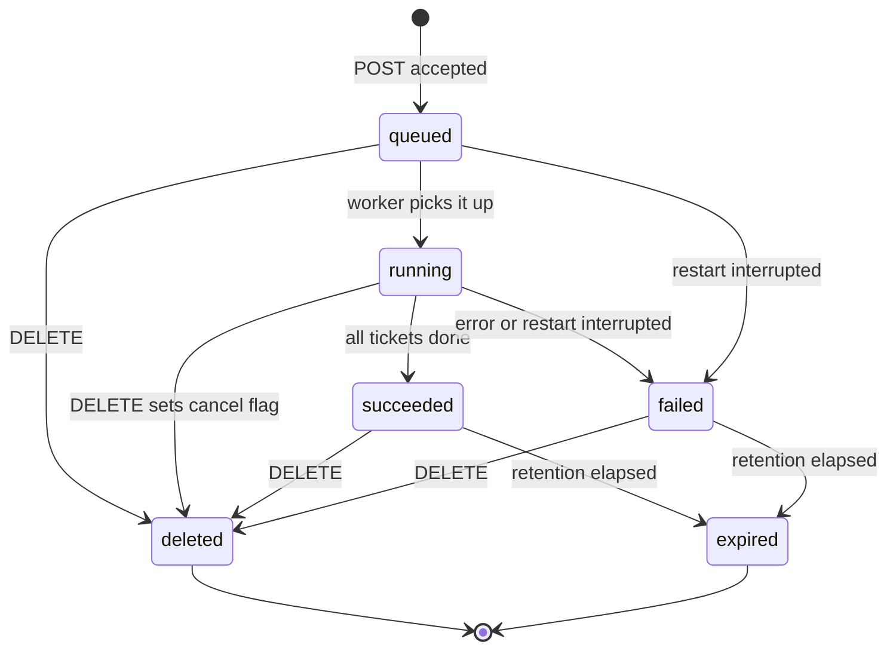
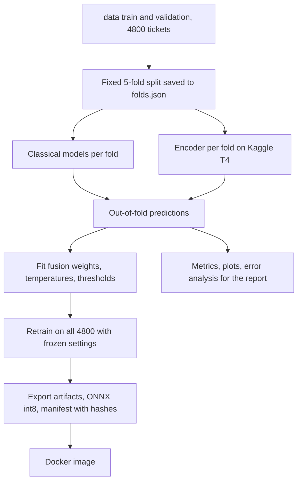

# TensorForge 2.0 Phase 2 - Architecture

Team Fade. This document is the single reference for **what we are building and why**. If code and
this document disagree, fix one of them deliberately. The organizers' contract in
[`spec/`](../spec/) is authoritative for everything the evaluation harness sees; this document
decides everything the contract leaves open.

Companion: [`IMPLEMENTATION_PLAN.md`](IMPLEMENTATION_PLAN.md) (work packages, schedule, tests, checklists).

---

## 1. Goal, scope and priorities

Build a hosted, API-key-protected service that classifies RideEat support tickets and routes them.

For each ticket the service returns `category`, `secondary_category` (or `null`), `team` (derived),
`is_urgent`, a calibrated `confidence` for the primary category, and `model_version`.

Scoring (guidelines section 3): **correctness, schema compliance, robustness**. Latency is not scored
(but the spec states targets we will respect). Priorities, in order:

1. **Contract and robustness are non-negotiable.** A wrong status code or a 5xx on odd input costs
   points across many automated checks. Model gains are worth little if the contract fails.
2. **Model quality**, shown with a visible, honest training and validation process.
3. **Reproducibility**: repo, `docker run` with no internet, report and video.
4. **Demo UI**: thin, last.

Hard constraints:

- No LLM does the classification. Classical ML and our own fine-tuned encoder only.
- `docker run -p 8000:8000 -e API_KEY=<key> <image>` starts it, `GET /health` is 200 within 120 s,
  no internet at runtime (all weights inside the image).
- The API key comes only from the `API_KEY` env var. Never in the repo, image, logs, report or video.
- Hosted at a stable HTTPS URL for the whole evaluation window, running the **same image and model
  version** as the submitted container.

Non-goals: multi-replica scaling, user accounts, a database server, training in production, any
runtime download, real-time retraining, an LLM anywhere in the prediction path.

---

## 2. Contract facts that drive the design

(Full detail in `spec/tensorforge-phase2-openapi-v2.yaml`; `scripts/verify_assets.py` keeps our copies honest.)

| Topic | Rule |
| --- | --- |
| Endpoints | `GET /health` (public); `POST /predict`; `POST /predict/batch` (1-100); `POST /batch/jobs` (1-5000); `GET /batch/jobs/{id}`; `DELETE /batch/jobs/{id}`; `GET /batch/jobs/{id}/results` |
| Auth | `X-API-Key: <key>` or `Authorization: Bearer <key>`, both accepted; constant-time compare; 401 + `WWW-Authenticate: Bearer`; unset `API_KEY` means 401 on protected endpoints |
| Check order (POST) | auth 401, content type 415, size 413, JSON parse 400, validation 422 |
| Size limits | `/predict` 1 MB, `/predict/batch` 5 MB, `/batch/jobs` 25 MB |
| Input | `channel` in {email, chat, call_transcript}; `text` 1-10000 chars with at least one non-whitespace; `subject` string up to 500 (optional); `ticket_id` string up to 64 (required in batch and jobs, unique); extra properties allowed and ignored |
| Output | `category`, `secondary_category` (key always present), `team`, `is_urgent`, `confidence` 0..1, `model_version`; echo `ticket_id`; optional `needs_human_review` |
| Consistency | `team` from the fixed table; `secondary != category`; spam implies `is_urgent=false` and `secondary=null`; `predictions[i]` matches `tickets[i]` |
| Batch | atomic: any invalid item fails the whole request with 422 and `details[].index` for every bad item |
| Jobs | submit 202 + `Location` + `Retry-After`; statuses `queued/running/succeeded/failed/cancelled`; results paged by `offset`/`limit`; 409 before success; 410 after expiry; 404 unknown or deleted; 429 when more than 1 running + 3 queued; `Idempotency-Key`; keep results at least 6 h; restart mid-job ends `failed` with `error.code=interrupted`; shared state; deterministic |
| Errors | always JSON `{"error":{"code","message","details?"}}`; unknown route 404 and wrong method 405 are JSON too; never 5xx for invalid input; never HTML or a stack trace |
| Model | sees only `channel`, `subject`, `text`; `ticket_id` and `language` are never features; ticket text is data, never instructions; independent per item (no dependence on position or batch mates) |
| Targets (2 vCPU / 4 GB) | `/predict` p95 under 1 s; 100-batch p95 under 30 s; job submit 202 under 5 s; 5,000-ticket job under 30 min; `/health` and job polling under 1 s while a job runs |

---

## 3. System context



- The container is the unit of deployment. The VM only runs Docker and Caddy.
- Training happens off the VM (laptop, Kaggle). Only frozen artifacts reach the image.

---

## 4. Runtime architecture (inside the container)

One container, one `uvicorn` process (single worker on purpose: job coordination stays simple and the
2 vCPU / 4 GB budget fits one model copy), serving API and static demo UI.



### 4.1 Module map (planned files)

| Module | Responsibility | Key interface |
| --- | --- | --- |
| `app/main.py` | create ASGI app, lifespan (start model loader, job manager), mount routes and UI | `app` |
| `app/config.py` | read env: `API_KEY`, `PORT`, `JOB_DB_PATH`, `INFERENCE_THREADS`, `LOG_LEVEL`, limits | `Settings` (frozen dataclass) |
| `app/labels.py` | the 11 categories, team table, channels; **single source of truth** (a test compares it to the spec enums) | `CATEGORIES`, `TEAM_BY_CATEGORY`, `CHANNELS` |
| `app/text.py` | text normalization shared by training and serving (one implementation, imported by `ml/`) | `build_input(channel, subject, text) -> str` |
| `app/errors.py` | `ApiError` exception, error catalog, JSON error builder, global exception handlers | `error_response(status, code, message, details)` |
| `app/middleware.py` | pure ASGI: request id, auth, content type, streaming size limit, JSON error for 404/405, last-resort 500 handler | `ContractMiddleware` |
| `app/auth.py` | extract key from either header, constant-time compare | `check_key(headers) -> bool` |
| `app/validation.py` | hand-written validators that mirror the JSON Schema and collect **all** errors with `index` | `validate_single(obj)`, `validate_batch(obj, max_items)` |
| `app/schemas.py` | response builders (plain dicts, orjson); optional pydantic only for typing | `prediction_to_dict(...)` |
| `app/inference.py` | the engine: load artifacts, predict one ticket, post-process, build output | `Engine.predict(ticket) -> Prediction` |
| `app/jobs.py` | job manager, SQLite store, state machine, idempotency, retention, worker thread | `JobManager` |
| `app/routes.py` | handlers for the 7 operations plus `GET /` info | router |
| `ui/` | static demo (plain HTML/JS/CSS, no build step) | served at `/demo/` |

Rules for the code layout:

- Validation does **not** rely on framework auto-validation (FastAPI's default 422 body has the wrong
  shape). Handlers receive raw bytes from the middleware, parse with `orjson`, then call our validators.
- `/docs`, `/redoc` and `/openapi.json` are disabled (they are HTML or off-contract). `GET /` returns a
  small JSON info object. The demo UI lives under `/demo/`, so unknown routes always get JSON 404.
- All JSON is produced with `orjson`. Numbers are plain floats rounded to 4 decimals.

### 4.2 Request lifecycle



Details that are easy to get wrong:

- Unknown routes are answered without auth (404 JSON). Known protected routes check auth first, even
  for a wrong method.
- Size is enforced by counting bytes **as they stream in** (reject early if `Content-Length` exceeds
  the limit, and also when chunked uploads exceed it). The 413 body is JSON. The reverse proxy limit
  (Caddy) is set above 25 MB so the app, not the proxy, answers.
- `X-Request-ID` is echoed in the response header when provided (including error responses).
- Any unexpected exception becomes `500 internal_error` JSON with no stack trace. A test proves that no
  generated invalid input reaches that path.
- Model not loaded yet: protected endpoints return `503 model_loading` JSON with `Retry-After`; health
  returns 503 `{"status":"loading","model_version":null,"model_loaded":false}`.

### 4.3 Validation rules (mirror of the JSON Schemas)

Per ticket: object required; `channel` required, one of the three values; `text` required, string,
1-10000 characters, at least one non-whitespace; `subject` optional string up to 500 (`null` is
invalid); `ticket_id` optional string up to 64 for `/predict`, **required** and unique for batch and
jobs. Unknown extra keys are ignored. Batch envelope: `tickets` required array of 1-100 (jobs 1-5000).
Each problem becomes `{index?, field, issue}`; every failing item is reported. Offsets and limits on
results: `offset >= 0`, `1 <= limit <= 5000`, integers, otherwise 422.

A differential test checks our validators against `jsonschema` on thousands of generated and mutated
payloads so the two agree.

### 4.4 Error catalog

| Status | `error.code` | When |
| --- | --- | --- |
| 400 | `malformed_json` | body is not valid JSON or not valid UTF-8 |
| 401 | `unauthorized` | missing or wrong key, or `API_KEY` unset |
| 404 | `not_found` / `job_not_found` | unknown route / unknown or deleted job |
| 405 | `method_not_allowed` | known path, unsupported method (with `Allow`) |
| 409 | `job_not_ready` | results requested while job is not `succeeded` |
| 410 | `job_expired` | retention passed |
| 413 | `payload_too_large` | over the endpoint limit |
| 415 | `unsupported_media_type` | content type is not `application/json` |
| 422 | `validation_error` | schema or business-rule failure, with `details` |
| 429 | `too_many_jobs` | more than 1 running + 3 queued; `Retry-After` |
| 500 | `internal_error` | last resort only |
| 503 | `model_loading` | model not ready |

---

## 5. Inference engine (the model)

### 5.1 Targets and label facts (from the dataset)

- `category`: 11 classes, imbalanced (payment_refund 18% down to spam_irrelevant 3%).
- `secondary_category`: present on 10% of tickets and only five classes occur:
  ride_trip_issue, payment_refund, app_technical, delivery_delay, order_missing_wrong.
- `is_urgent`: 10% overall; never urgent for account_promo, app_technical, general_inquiry,
  spam_irrelevant; 75% of safety_conduct.
- Language mix is 35/25/20/15/2.5/2.5 (en, singlish, si, ta, tanglish, mixed) but the hidden set may
  differ, and the model never receives `language`.
- Labelling rules in `data/DATA_NOTES.md` (safety takes precedence, secondary for late-food refunds,
  OTP/login is account_promo, etc.) are what the model must learn; error analysis is organized by them.

### 5.2 Pipeline



1. **Input string.** `build_input` produces e.g. `"[email] <subject> || <text>"` (channel and subject
   are signals; `ticket_id` and `language` are not). Normalization: Unicode NFC (never strip
   zero-width joiners: Sinhala needs U+200D), strip control characters, collapse whitespace, lowercase
   Latin letters only, keep emoji and digits. Identical function used in training and serving.
2. **Classical branch (always present).** TF-IDF on word 1-2 grams plus `char_wb` 2-5 grams (robust to
   Singlish/Tanglish spelling variance and native scripts). Three heads: category (multinomial
   logistic regression or calibrated LinearSVC), secondary (one-vs-rest over the five observed classes),
   urgent (binary, may also use the category probabilities).
3. **Encoder branch (adopted only if it earns its place).** Multilingual encoder (candidates:
   `xlm-roberta-base`, `multilingual-e5-small/base`) fine-tuned with three heads on a shared pooled
   embedding: category (11 logits), secondary (5 sigmoid logits), urgent (1 logit). Exported to one ONNX
   graph (int8 dynamic quantization). Tokenization with the `tokenizers` library (no `transformers` at
   runtime). Truncation keeps head and tail (about 192 + 64 tokens).
4. **Fusion.** Weighted average of calibrated probabilities per head; weights, per-head temperatures
   and thresholds are fitted on **out-of-fold** predictions, never on data the models trained on.
5. **Post-processing (order matters).**
   1. `category = argmax` of fused category probabilities; `confidence` = its calibrated probability.
   2. Secondary candidate = highest of the five secondary probabilities excluding the primary; accept
      only if above the tuned threshold, else `null`.
   3. `is_urgent` = fused urgency probability above the tuned threshold.
   4. Rules: spam forces `is_urgent=false`, `secondary=null`; urgency is false for the four categories
      that are never urgent; `secondary != category`; `team = TEAM_BY_CATEGORY[category]`.
   5. `needs_human_review = confidence < review_threshold` (threshold documented in the README).
6. **Determinism and independence.** Encoder runs at batch size 1 (dynamic length) so a ticket's output
   cannot depend on padding or batch mates. One shared ONNX Runtime session with `intra_op_num_threads=1`
   and `inter_op_num_threads=1` (sessions are thread-safe; each call then runs on its calling thread, so
   a job and a live request each get their own core instead of fighting for both). No sampling, no
   randomness. The same
   `Engine.predict` serves `/predict`, `/predict/batch` and jobs, so results are identical across
   endpoints and repeat runs. A test asserts this.
7. **Safety against ticket content.** There is no LLM, so injected instructions cannot change behaviour;
   the model simply sees them as text. We still evaluate on the injection-style tickets as a slice.

### 5.3 Confidence

Confidence is scored for calibration and abstention, so it must reflect real uncertainty. We apply
temperature scaling (or isotonic regression) on OOF fused probabilities, report ECE, Brier score and a
reliability diagram, and verify that confidence is lower on ambiguous or noisy tickets and on languages
where accuracy is lower.

### 5.4 Resource budget (2 vCPU / 4 GB)

Targets, to be measured in WP7: classical branch under 20 ms per ticket; encoder (int8, seq up to 256)
about 60-150 ms per ticket on 2 threads, so `/predict` p95 well under 1 s, a 100-ticket batch in roughly
5-15 s, and 5,000 ticket jobs in roughly 5-15 minutes (limit 30). Resident memory under about 2 GB.
If measurements break these, fall back to the classical-only model or a smaller encoder (decision
gate in the implementation plan).

---

## 6. Job subsystem

### 6.1 State machine



`cancelled` exists in the API enum for completeness; since the spec says a deleted job returns 404
afterwards, the job row is removed on `DELETE` and cancellation only shows up if a client polls in the
instant between the cancel flag and the removal. Expired jobs keep a tombstone row (id and
`expires_at`) so status and results return **410** instead of 404 until the tombstone is purged (days).

### 6.2 Storage: SQLite (WAL) at `JOB_DB_PATH`

Default `/data/jobs.sqlite3` inside the container (created if missing, falls back to a temp dir if
not writable, so the plain `docker run` works). On the VM a Docker volume keeps it across restarts.

- `jobs(job_id PK, status, total, processed, created_at, started_at, finished_at, expires_at,
  model_version, error_code, error_message, idempotency_key UNIQUE NULL, payload_hash)`
- `job_results(job_id, idx, prediction_json, PRIMARY KEY(job_id, idx))` so paging by `offset`/`limit`
  is a stable indexed range query in original order.

### 6.3 Behaviour

- **Submit.** After the standard checks the full payload is validated (all items). On success, **inside
  one critical section** (a process-wide lock around the SQLite transaction, so parallel identical
  requests cannot race): apply the idempotency rule, check capacity, insert `queued`. As a second line
  of defence, a `sqlite3.IntegrityError` on the unique `idempotency_key` is caught and answered by
  fetching and returning the existing job with `202`, never a 500. Then push the job onto an in-memory FIFO (tickets
  stay in memory, they are not needed after a crash because the job just fails), return `202` with the
  status body, `Location: /batch/jobs/{job_id}` and `Retry-After: 2`. Job ids are UUID4.
- **Capacity.** At most 1 running and 3 queued. A fifth active job gets `429 too_many_jobs` with
  `Retry-After`. Idempotent resubmission of an existing job never counts against capacity.
- **Idempotency.** Same `Idempotency-Key` returns the existing job and `202`. If the key exists but the
  payload hash differs we still return the original job (documented), never create a duplicate.
- **Worker.** One daemon thread. For each ticket it calls `Engine.predict`, writes results in chunks
  (for example every 50 tickets: insert results and update `processed` in one transaction), checks the
  cancel flag between chunks, and yields to live traffic: it never holds a lock the request path needs,
  and calls `time.sleep(0.005)` every 25 tickets so Python-level work (normalization, TF-IDF) cannot
  starve the event loop through the GIL (it is a thread, so `time.sleep`, not `asyncio.sleep`).
  Live requests run inference in a thread pool, never on the event loop. `processed` never decreases.
- **Polling.** `GET` returns status, counts, timestamps, `model_version`, `error`, and
  `Retry-After: 2` while `queued` or `running`. Polls read SQLite only (fast, independent of inference).
- **Results.** `409` unless `succeeded`; `offset`/`limit` paging with `next_offset` (null on the last
  page); default is everything; identical request gives identical bytes.
- **Retention.** `expires_at = finished_at + 12 h` (spec minimum is 6 h). A background sweep converts
  expired jobs to tombstones and deletes their results.
- **Restart tolerance.** On startup, every `queued` or `running` row becomes `failed` with
  `error.code=interrupted` and message "Service restarted while the job was running." Nothing vanishes.
- **Unexpected exception in a job.** The job ends `failed` with `error.code=internal_error`; the worker
  thread survives and continues with the next job.

---

## 7. Training and evaluation architecture (`ml/`)



Protocol:

- **Stage A (organizer-style check).** Train on `train`, evaluate on `validation`. Gives the first honest
  numbers and a sanity check before any CV.
- **Stage B (CV).** 5 folds over train+validation, stratified on category and language, one saved
  `folds.json` reused by every experiment so results are comparable. OOF predictions feed fusion.
- **Final model.** One model per branch trained on all 4,800 tickets using the settings frozen from CV
  (epochs, thresholds). We ship one encoder, not five fold models (inference cost).
- **Metrics.** Category accuracy and macro-F1 with per-class F1 and confusion matrix; secondary exact
  match and per-class F1; urgent precision/recall/F1; ECE and Brier; all sliced by language and channel;
  leave-one-language-out for robustness; robustness slices (injection-style text, emoji-only,
  very long, typos).
- **Experiment log.** Every run appends to `ml/reports/experiments.csv` (id, date, branch, features,
  hyperparameters, CV metrics, notes). This table is the backbone of the report and the video.
- **Gate for the encoder.** Adopt it only if CV macro-F1 improves by at least about one point or the
  calibration/robustness clearly improves, **and** the latency and memory budget (5.4) is met.
- **Where it runs.** Classical and smoke tests on the laptop; encoder CV and final training on a free
  Kaggle T4 (private dataset upload, never the `.env`). `ml/train_encoder.py` is device-agnostic, so the
  same script is the documented training procedure.
- **Reproducibility.** Fixed seeds, pinned versions (`requirements-train.lock.txt`), scripts committed,
  metrics regenerable with one command.

---

## 8. Artifacts and model versioning

`artifacts/` contains: classical models (joblib), vectorizers, label maps, `encoder.int8.onnx`,
`tokenizer.json`, `fusion.json` (weights, temperatures, thresholds incl. the review threshold) and
`manifest.json`.

`manifest.json` holds `model_version`, a SHA-256 for each file, training date, git commit, metrics
summary and base-model license notes. `model_version` has the form `v1.0.0-<first 8 hex of manifest
hash>` and is the **only** value returned by `/health`, `/predict`, `/predict/batch`, job status and job
results. The Docker build runs a self-test (load artifacts, verify hashes, predict a fixed set of
tickets and compare to stored expected outputs) so a broken or mismatched image cannot be built.

Large files: stay under GitHub's 100 MB per file (int8 compression), else Git LFS or a GitHub Release
(decided when the exported size is known; the image is always built from files in the repo or the
release).

---

## 9. Deployment architecture

- **Image.** Multi-stage Dockerfile, `python:3.12-slim`, only `requirements.txt` (CPU), artifacts copied
  in, non-root user, `PORT=8000`, `HEALTHCHECK` on `/health`, no `API_KEY` baked in, nothing downloaded at
  runtime. `.dockerignore` keeps `.env`, data and docs out. The image does **not** install
  `transformers` or `huggingface_hub` (runtime uses only `tokenizers` + `onnxruntime`, which never touch
  the network), and sets `HF_HUB_OFFLINE=1`, `TRANSFORMERS_OFFLINE=1`, `TOKENIZERS_PARALLELISM=false` as
  belt and braces. The real proof is the `--network none` start test.
- **Startup.** The HTTP server starts listening immediately; the model loads in a background thread.
  `/health` is 503 while loading, 200 when ready (target well under 120 s).
- **VM.** Azure Ubuntu, 2 vCPU / 4 GB (Standard_B2s class), static public IP, DNS label
  `<label>.<region>.cloudapp.azure.com`, NSG open for 80/443 and SSH from our IP only.
- **TLS.** Caddy terminates HTTPS (automatic Let's Encrypt) and proxies to `127.0.0.1:8000`. Caddy has no
  default body cap, but anything above whatever cap we set gets Caddy's own plain-text 413, not our JSON
  one. So the proxy cap sits far above the app's 25 MB limit and the app answers every oversized body
  with a JSON 413:

  ```caddyfile
  <label>.<region>.cloudapp.azure.com {
      request_body {
          max_size 64MB
      }
      reverse_proxy 127.0.0.1:8000 {
          transport http {
              response_header_timeout 120s
          }
      }
  }
  ```

  Verified in WP9 by sending bodies of 1 MB+1, 5 MB+1, 25 MB+1 and 40 MB through the proxy and checking
  that each gets a JSON 413 from the app.
- **Run.** `docker run -d --restart unless-stopped -p 127.0.0.1:8000:8000 --env-file /etc/tensorforge/env
  -v tf_data:/data <image@digest>`. The env file is root-only. Docker and Caddy start on boot. An
  external uptime monitor pings `/health`.
- **Same image rule.** Build once, push to a registry, pull the exact digest on the VM, and record that
  digest in the report. The submitted `docker run` instructions use the same image.

---

## 10. Security and privacy

- Key from env only; constant-time comparison (`hmac.compare_digest`); never logged; not in the image,
  repo, docs or screenshots. The pre-commit hook and CI scan block `tf2_` keys and `.env`.
- Auth runs before any body parsing; unauthenticated requests never touch the model.
- Logs are structured JSON: request id, method, path, status, duration, ticket count. **No ticket text and
  no key** are logged.
- No stack traces or internal paths in responses. Input is size-bounded and parsed with `orjson`.
- The demo UI is key-gated: the visitor pastes the key, kept only in that browser tab's session storage
  and sent as `X-API-Key` to the same origin. No key is embedded in the page, and no unauthenticated
  prediction route exists.
- Artifacts are our own files loaded with `joblib` (trusted source); hash-verified at startup.

---

## 11. Failure modes and responses

| Failure | Behaviour |
| --- | --- |
| Model still loading | health 503, protected endpoints 503 `model_loading` |
| Artifact missing or hash mismatch at startup | log error, stay `loading`/unhealthy (never serve wrong predictions); caught earlier by the Docker self-test |
| Bad or oversized input | 4xx JSON per the check order |
| Encoder exception on one ticket | catch, fall back to the classical branch for that ticket, still return 200 with a valid response; log it |
| Both branches fail on one ticket | job: ticket fails the job with `internal_error`; `/predict`: 500 JSON (should be unreachable, covered by fuzz tests) |
| Container restart mid-job | job becomes `failed/interrupted` at next startup |
| Disk or SQLite error on submit | 503/500 JSON, no partial job |
| Many concurrent live requests | bounded thread pool; requests queue; no crash, health stays responsive |
| Wrong API key flood | cheap 401s; no rate limiter that could lock out the judges |

---

## 12. Decision log

| # | Decision | Reason | Revisit if |
| --- | --- | --- | --- |
| D1 | FastAPI app with pure ASGI middleware, hand-written validators | exact error shapes and check order; default 422 format is wrong | never |
| D2 | One uvicorn worker, in-process job worker thread, SQLite for state | simplest correct design for one container; spec's shared-state rule satisfied by the DB | we add replicas |
| D3 | Encoder inference at batch size 1 | guarantees independence and determinism | latency fails the targets |
| D4 | Classical + encoder fusion, calibrated on OOF predictions | robust on small noisy multilingual data, honest confidence | encoder fails the gate in 7 |
| D5 | Secondary as one-vs-rest over the 5 observed classes plus threshold | 10% prevalence, only 5 classes observed | hidden set shows other classes |
| D6 | NFC normalization, keep ZWJ, lowercase Latin only | Sinhala/Tamil need combining marks and joiners | EDA shows noise needing more cleaning |
| D7 | Single final model trained on all 4,800 tickets | inference cost, simplicity | none |
| D8 | UI at `/demo/`, key-gated; `/` is JSON; docs routes disabled | unknown routes must be JSON, no unauthenticated prediction | never |
| D9 | Jobs retained 12 h; tombstones give 410 | spec minimum 6 h, margin for slow judges | disk pressure |
| D10 | Caddy + Azure VM + static IP + default DNS label | confirmed by the team | never |
| D11 | Dataset and organizer booklet not in the public repo | redistribution caution | organizers allow it |
| D12 | Kaggle T4 for encoder CV, laptop for everything else | speed; script stays device-agnostic | Kaggle unavailable (fallback: laptop, smaller model) |

---

## 13. Guardrails: things we will not do

- No LLM or hosted API in the prediction path, not even "just for hard cases".
- No downloads, telemetry or network calls at runtime.
- No feature from `ticket_id` or `language`; no dependence on batch position or batch mates.
- No hard-coded key, no key in logs, docs, notebooks, test fixtures or the UI source.
- No changing the contract by convenience (field names, enums, status codes); change the code instead.
- No model changes after the freeze point without re-running the full contract suite and rebuilding
  the image and manifest.
- No "works on my machine" deploys: the hosted instance runs the recorded image digest.
